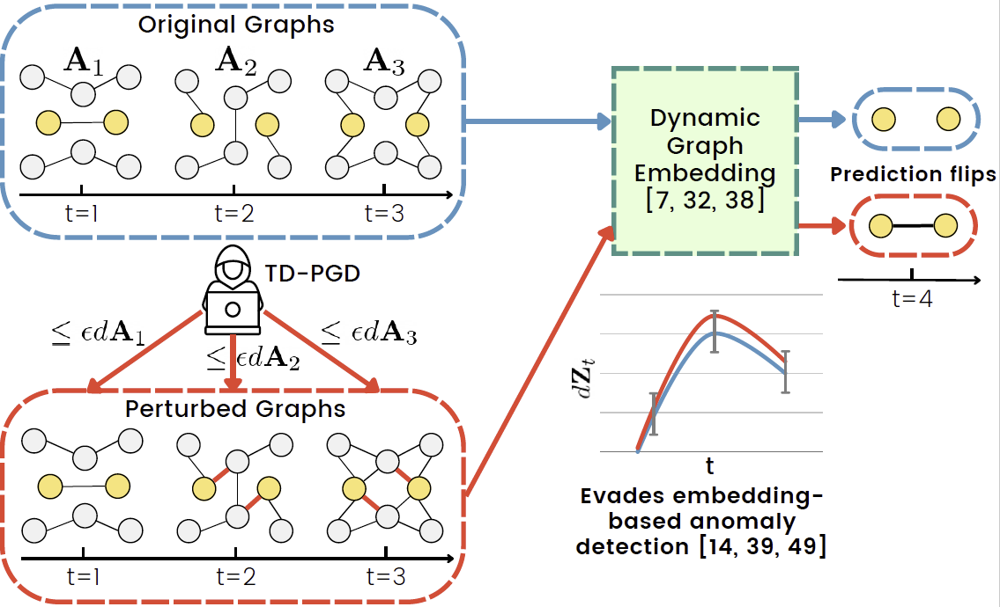

# Temporal Dynamics-Aware Adversarial Attacks on Discrete-Time Dynamic Graph Models
Code for the work published at KDD 2023

## Citation
> @inproceedings{sharma2023temporal,\
    title={Temporal Dynamics-Aware Adversarial Attacks on Discrete-Time Dynamic Graph Models},\
    author={Sharma, Kartik and Trivedi, Rakshit and Sridhar, Rohit and Kumar, Srijan},\
    booktitle={29th SIGKDD Conference on Knowledge Discovery and Data Mining - Research Track},\
    year={2023},\
    url={https://openreview.net/forum?id=Ox39VUFu-v}\
}

&nbsp;

## Requirements
We use Python 3.8 for this implementation. Our code extensively uses the following 3 libraries: 
1. PyTorch 1.7 ([link](https://pytorch.org/get-started/locally/))
2. PyTorch Geometric ([link](https://pytorch-geometric.readthedocs.io/en/latest/notes/installation.html))
3. PyTorch Geometric Temporal ([link](https://pytorch-geometric-temporal.readthedocs.io/en/latest/notes/installation.html)) 

Follow the steps in the given links to install these libraries for your system configuration. 

A full set of requirements is given in `requirements.txt`, which can be used to create a conda virtual environment as:

> `conda create --name <env> --file requirements.txt`

## Data
We use these 4 datasets in this work:
1. Radoslaw ([link](http://konect.cc/networks/radoslaw_email/))
2. UCI ([link](http://konect.cc/networks/opsahl-ucsocial/))
3. Reddit hyperlinks ([link](https://snap.stanford.edu/data/soc-RedditHyperlinks.html))
4. DBLP-5 ([link](https://www.dropbox.com/sh/33p0gk4etgdjfvz/AACe2INXtp3N0u9xRdszq4vua?dl=0)) 

To create a discrete-time dynamic graph with a given number of snapshots, use the following command inside `./data/`:

> `python get_data.py --dataset <dataset_name> --num_graphs <num_snapshots>`,

where `dataset_name` is the name of the directory inside which the dataset is stored in the data folder. We provide the pre-processed graphs for the 4 datasets inside `./data/`. 

## Training victim models

We support training of 3 victim dynamic graph models - DySAT, EvolveGCN (both EvGCNO and EvGCNH), and GCLSTM. To train these models, go inside `./models/` and run the file `train_models.sh`. 

DySAT is not provided by the torch_geometric_temporal library, so we use the available pytorch implementation. In order to train it, clone their repository inside `models/` directory as:

> `git clone https://github.com/FeiGSSS/DySAT_pytorch`

The description of the given arguments is given inside `args.py`. These arguments can be modified in order to train for different settings. In particular, one can change the field of `dataset` and `model_name` to train a specific dataset and model. Other parameters such as `nepochs`, `learning_rate`, and `neg_weight` can be tuned accordingly to train the model in a given setting. Note that the argument `-dyn_feats` must be passed when the dataset has dynamic features (like in DBLP), otherwise it must not be passed. 

## Baseline attack methods

### Greedy

1. Open `run_greedy.sh` and edit the fields according to the desired attack setting. 
2. Specify the `model_name`, `dataset`, `task` for attacking. Also, don't forget to pass `dyn_feats` if the dataset has dynamic features.
3. Change the `epsilons_arr` to include the epsilon values that are to be tested on. 
4. > Run `./run_greedy.sh`. 

### Degree

1. Open `run_baselines.sh` and edit the fields according to the desired attack setting. 
2. Change the `method` field to `degree`. 
3. Specify the `model_name`, `dataset`, `task` for attacking. Also, don't forget to pass `dyn_feats` if the dataset has dynamic features.
4. Change the `epsilons_arr` to include the epsilon values that are to be tested on. 
5. > Run `./run_baselines.sh`. 

### Random

1. Open `run_baselines.sh` and edit the fields according to the desired attack setting. 
2. Change the `method` field to `degree`. 
3. Specify the `model_name`, `dataset`, `task` for attacking. Also, don't forget to pass `dyn_feats` if the dataset has dynamic features.
4. Change the `epsilons_arr` to include the epsilon values that are to be tested on. 
5. In case of feature perturbation, pass `constraint` as `noise_feat` instead of `noise`.
6. > Run `./run_baselines.sh`. 

## TD-PGD

### Attack
1. Open `run_pgd.sh` and edit the fields according to the desired attack setting. 
2. Specify the `model_name`, `dataset`, `task` for attacking. Also, don't forget to pass `dyn_feats` if the dataset has dynamic features.
3. Change the `epsilons_arr` to include the epsilon values that are to be tested on. 
4. In case of feature perturbation, set `constraint` as `noise_feat` instead of `noise`. 
5. In case of an **online attack**, set `online` as `True`. 
6. > Run `./run_pgd.sh`. 

### Anomaly Detection
**Netwalk**: Run `run_attk_anomaly.sh` for the required attack settings and find t-test between the scores stored in the pickle files using scikit-learn functions.

**DynGem**: After storing the attacks, run `combine_results_noise_dzttest.py` to obtain a t-test statistic and dz between dz'. 

## Analysis

1. Open `combine_results_noise.py`.
2. Choose the `method` from one of the following - `pgd`, `greedy`, `degree`, and `random`. 
3. Select constraint as `noise` for structural and `noise_feat` for feature perturbations.
4. Make `online` to be `True` for online attacks. 
5. > Run `python combine_results_noise.py 

This will store the results inside the folder `av_results/`. 

## Visualization

Follow the notebook `visualize.ipynb` to make plots from a raw_results.tsv which can be formed by appending the results of different methods from `av_results` in one file. 